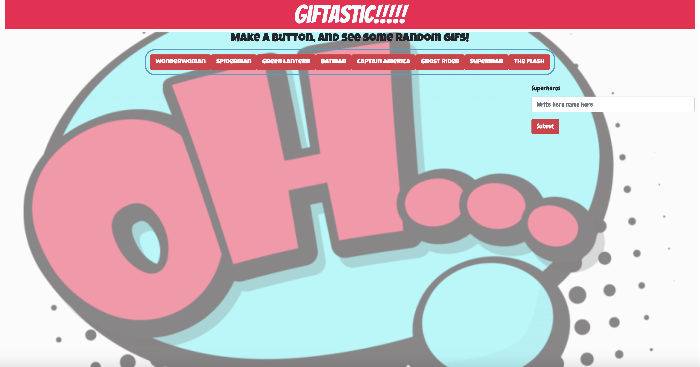

# GifTastic-webpage
Assignment 6 using the GIPHY API

## Instructions
1. Write a superhero name in the form element
2. Click 'Submit' and a button will appear in the button box.
3. Click any of the buttons and 10 GIFs will appear below. 
4. To remove a button, double click the button. 

## Author and Acknowledgement
Author: John Pendergrass

#### Colaborated with:
1. Amy Hearr
2. Chelseay Masood

## Works cited
• W3Schools.com
• Codepen.com

## Important links
- Repository link: https://github.com/JohnWP8253/GifTastic-webpage
- Github link: https://johnwp8253.github.io/GifTastic-webpage/

## Image of Website
 
